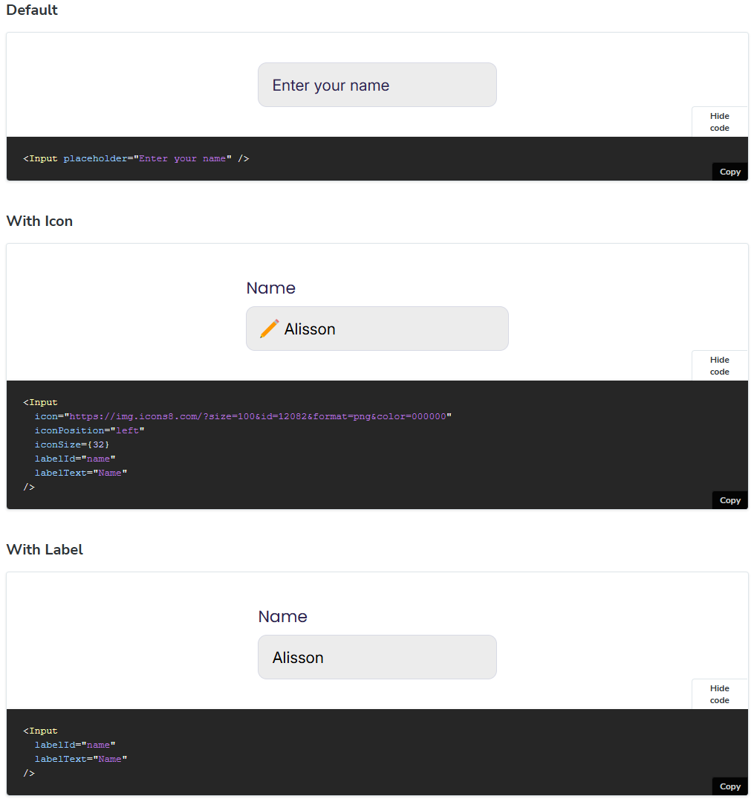
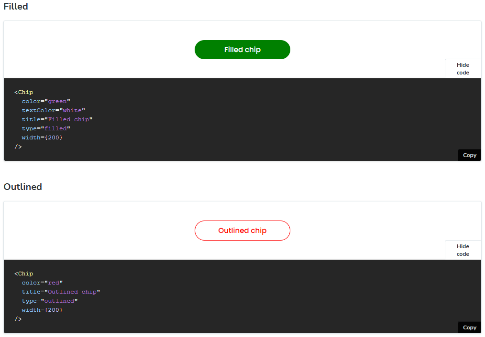
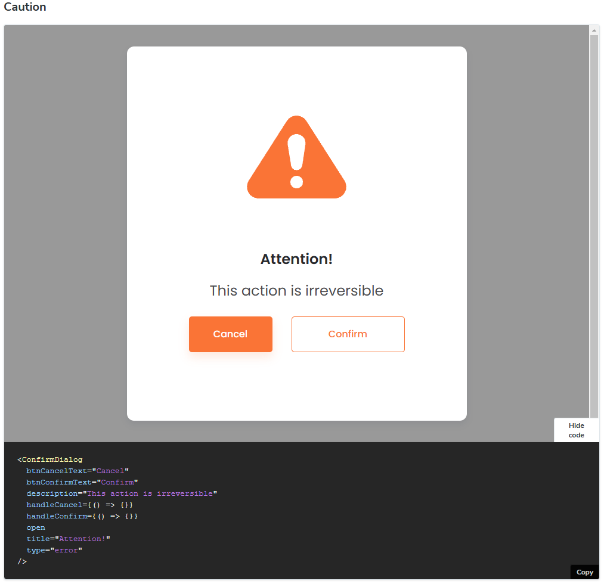
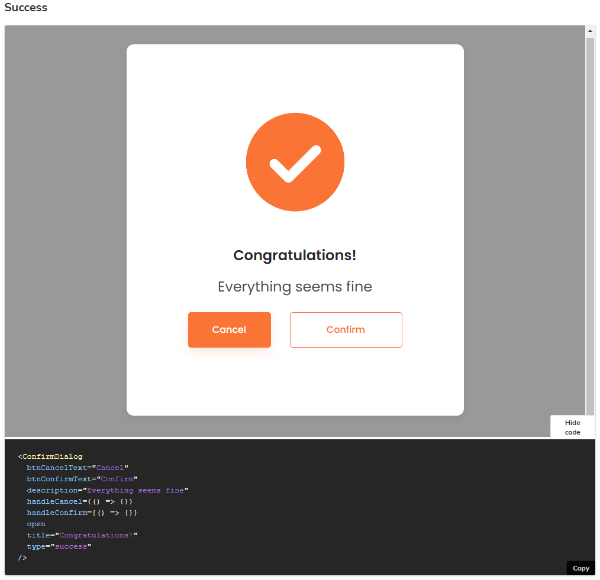
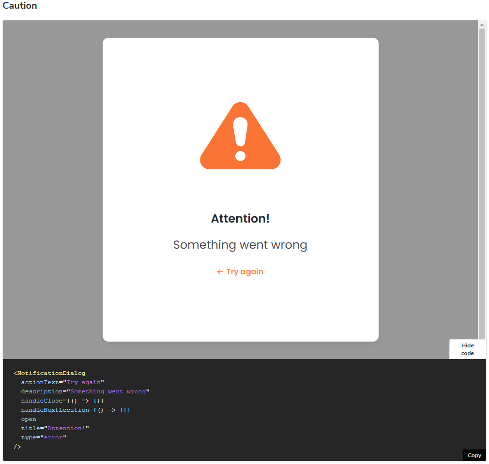
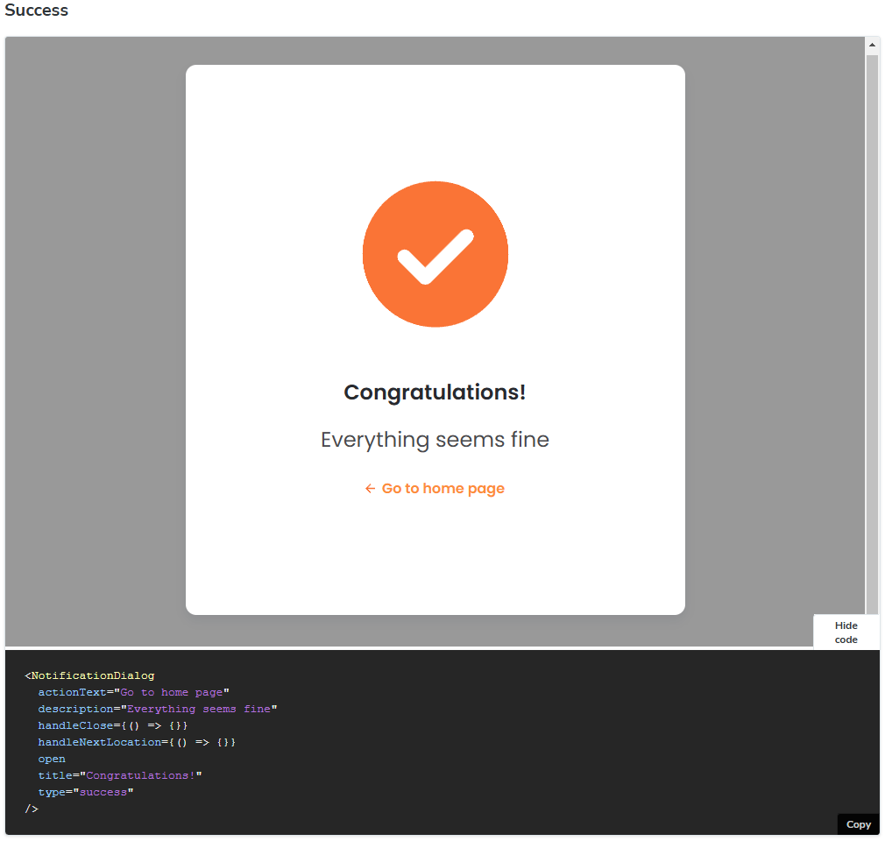
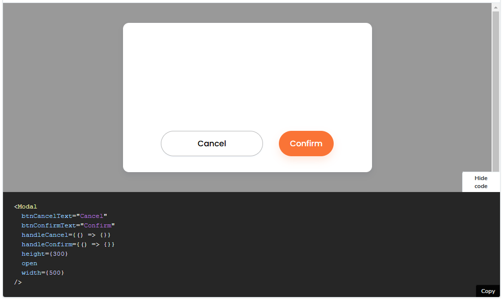

<h1 align="center">Hotel Booking Component Library</h1>

### 🚀 Technologies

- [Tsdx](https://tsdx.io/)
- [Typescript](https://www.typescriptlang.org/)
- [Webpack](https://webpack.js.org/)
- [Sass](https://sass-lang.com/)
- [Storybook](https://storybook.js.org/)

---

## 📋 Form components

- <h3>Button</h3>

- <h3>Input</h3>

---

## ⚙️ General components

- <h3>Chip</h3>

- <h3>Confirm Dialog</h3>

- <h3>Notification Dialog</h3>

- <h3>Modal</h3>

---

### 👉 [See my Linkedin](https://www.linkedin.com/in/alisson-modesto-fullstack-developer/)
